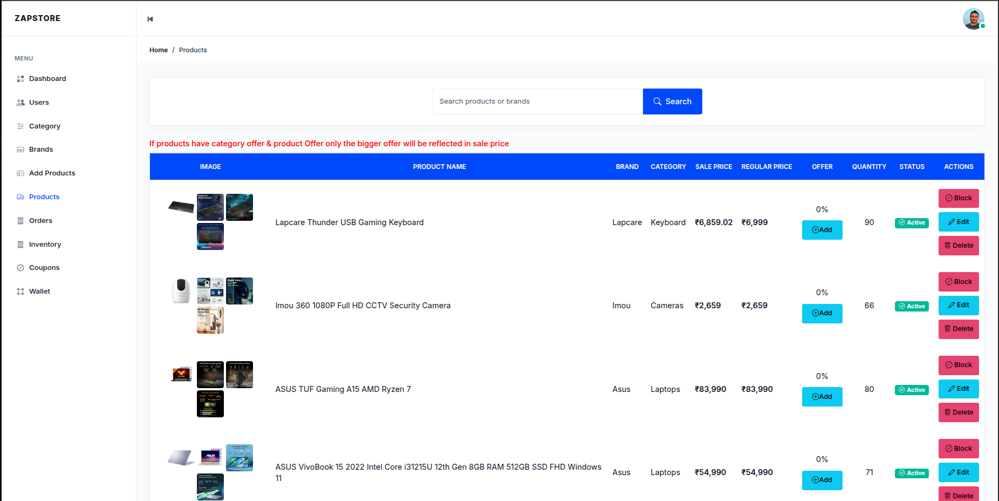

# 🛒 Zapstore

<div align="center">
  <h3>E-commerce Web Application</h3>
  
  [](https://opensource.org/licenses/MIT)
  [](https://nodejs.org/)
  [](https://www.mongodb.com/)
  [](https://expressjs.com/)
  
  <p>Zapstore is a full-stack e-commerce web application designed to provide a seamless online shopping experience with comprehensive features for both customers and administrators.</p>
</div>

## 🚀 Live Demo

[View Live Application](https://www.zapstoretech.shop/)

## 📸 Screenshots

### Customer Interface

| Homepage                                         | Product Catalog                                  | Shopping Cart                                       | User Profile                                        |
| ------------------------------------------------ | ------------------------------------------------ | --------------------------------------------------- | --------------------------------------------------- |
|  |  |  |  |

### Admin Dashboard

| Dashboard Overview                                           | Product Management                                             | Sales Reports                                   | Users                                          |
| ------------------------------------------------------------ | -------------------------------------------------------------- | ----------------------------------------------- | ---------------------------------------------- |
|  |  |  |  |

## ✨ Features

### 🛍️ Customer Features

- **User Authentication** - Secure registration and login system
- **Product Catalog** - Browse products with advanced search and filtering
- **Shopping Cart** - Add, remove, and manage cart items
- **Secure Checkout** - Integrated with Razorpay payment gateway
- **Order Management** - Track orders, request returns, and manage refunds
- **User Profile** - Update personal details and manage addresses
- **Wallet System** - In-app wallet for credits and refund processing
- **Referral Program** - Earn rewards by referring new users

### 🔧 Admin Features

- **Dashboard Analytics** - Comprehensive overview of sales and user activity
- **Product Management** - Full CRUD operations for products and inventory
- **Brand Management** - Add, edit, and organize product brands
- **Order Processing** - View, process, and manage customer orders
- **Sales Reports** - Generate detailed daily, weekly, and monthly reports
- **Coupon System** - Create and manage discount coupons
- **Offer Management** - Set up special offers for products and brands
- **User Management** - Monitor and manage customer accounts

## 🛠️ Technologies Used

### Frontend

- **EJS Templates** - Server-side rendering for optimal SEO
- **HTML5** - Modern, responsive design
- **Vanilla JavaScript** - Interactive user experience

### Backend

- **Node.js** - Runtime environment
- **Express.js** - Web application framework
- **MongoDB** - NoSQL database for flexible data storage
- **Mongoose** - Object modeling for MongoDB
- **Redis** - For multiple sessions

### Authentication & Security

- **JSON Web Tokens (JWT)** - Secure user authentication
- **bcrypt** - Password hashing and security

### Payment & Integration

- **Razorpay** - Secure payment gateway integration

### Development Tools

- **Multer** - File upload handling for product images
- **dotenv** - Environment variable management
- **Nodemon** - Development server with hot reload

### Deployment

- **AWS (Amazon Web Services)** - Cloud hosting for scalability

## 📋 Prerequisites

Before running this application, make sure you have the following installed:

- **Node.js** (v16 or higher)
- **MongoDB** (v4 or higher)
- **npm**
- **Git**

## 🚀 Installation & Setup

### 1. Clone the Repository

```bash
git clone https://github.com/yourusername/zapstore.git
cd zapstore
```

### 2. Install Dependencies

```bash
npm install
```

### 3. Environment Configuration

Ensure Redis is installed and running on your system.

Create a `.env` file in the root directory and refer to `.env.example` for the required variables.

### 4. Database Setup

Make sure MongoDB is running on your system, then the application will automatically connect to the database specified in your `.env` file.

### 5. Start the Application

```bash
# Development mode with nodemon
npm run dev

# Production mode
npm start
```

The application will be available at `http://localhost:3000`

## 📁 Project Structure

```
zapstore/
├── controllers/           # Route controllers
│   ├── admin/            # Admin-specific controllers
│   └── user/             # User-specific controllers
├── models/               # Database models
│   ├── User.js
│   ├── Product.js
│   ├── Order.js
│   ├── Category.js
│   ├---etc/
├── routes/               # Express routes
│   ├── admin/            # Admin routes
│   └── user/             # User routes
├── views/                # EJS templates
│   ├── admin/            # Admin interface templates
│   ├── user/             # User interface templates
│   └── partials/         # Reusable template parts
├── public/               # Static assets
|   ├── assets/
│   ├── css/              # Stylesheets
│   ├── js/               # Client-side JavaScript
│   ├── images/           # Static images
│   └── uploads/          # User uploaded files
├── middleware/           # Custom middleware
├── utils/                # Utility functions
├── config/               # Configuration files
├── .env.example          # Environment variables template
├── app.js                # Main application file
├── package.json          # Project dependencies
└── README.md            # Project documentation
```

## 🔧 Usage

### For Customers

1. **Register** - Create a new account or log in with existing credentials
2. **Browse** - Explore the product catalog using search and filters
3. **Shop** - Add items to your cart and proceed to secure checkout
4. **Track** - Monitor your orders and manage returns through your profile

### For Administrators

1. **Access Admin Panel** - Navigate to `/admin` and log in with admin credentials
2. **Manage Products** - Add, edit, or remove products from the catalog
3. **Process Orders** - View and manage customer orders
4. **Generate Reports** - Create sales reports for business insights
5. **Manage Offers** - Create coupons and special promotions

## 👨‍💻 Author

**Sarath**

- GitHub: [@sarath](https://github.com/Sarathjithu89)
- LinkedIn: [Sarath](https://www.linkedin.com/in/sarath-a-8601a5201/)

---

<div align="center">
  <p>Made with ❤️ by Sarath</p>
</div>
